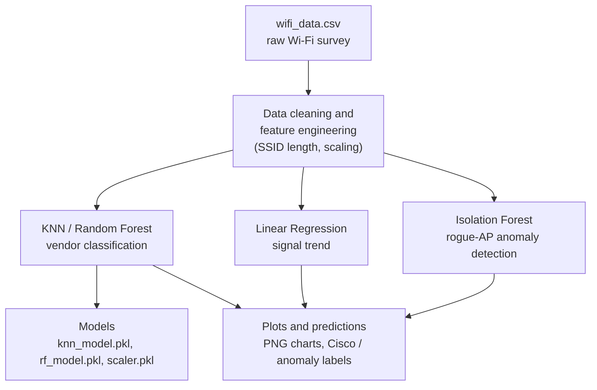

# CyberPulse AI 🌐🤖

## Overview 📡
**CyberPulse AI** is a machine learning project that classifies Wi-Fi devices as
`Cisco Systems Inc.` or not, using signal strength, channel, and SSID data from a
Wi-Fi survey dataset (`wifi_data.csv`). It combines K-Nearest Neighbors (KNN),
Random Forest, and anomaly detection to support **network diagnostics and
penetration-testing workflows** through device fingerprinting, rogue access point
detection, and network mapping 🔒.

> ⚠️ **Ethics/legal note:** Use this project only on networks you own or are
> explicitly authorized to assess.

## ML Pipeline 🧭


### Key Features ✨
- **Device Classification** 🖥️: Tuned KNN (via `GridSearchCV`) and Random Forest.
- **Signal Trend Analysis** 📈: Linear Regression over channel and time.
- **Anomaly Detection** 🚨: Isolation Forest flags potential rogue access points.
- **Feature Engineering** 🔍: SSID length as an extra signal.
- **Visualizations** 📊: Model comparison, box plots, anomaly scatter, regression plots.
- **Model Export** 💾: Saves `knn_model.pkl`, `rf_model.pkl`, and `scaler.pkl`.
  The classifiers are trained on **scaled** features, so any downstream use must
  first transform inputs with the exported `scaler.pkl` (see *Reusing the exported
  models* below).

### Tech Stack 🛠️
- **Language**: Python 🐍
- **Libraries**: pandas, NumPy, scikit-learn, matplotlib, seaborn, joblib

## Dataset 📂
- **File**: `wifi_data.csv` (semicolon-delimited, `ISO-8859-1` encoded)
- **Expected columns**: `Time`, `MAC.Address`, `Vendor`, `SSID`, `Signal.Strength`,
  `Channel`, `Survey`
- **Note**: The dataset is **not** included in this repository. Place your own
  `wifi_data.csv` in the project root before running the notebook. It is
  git-ignored so raw capture data is never committed.

## Setup 🚀
1. Clone the repository:
   ```bash
   git clone https://github.com/kassam-99/CyberPulse-AI.git
   cd CyberPulse-AI
   ```
2. (Recommended) create a virtual environment:
   ```bash
   python3 -m venv .venv && source .venv/bin/activate
   ```
3. Install dependencies:
   ```bash
   pip install -r requirements.txt
   ```
4. Place your `wifi_data.csv` in the project root.

## Running the Notebook ▶️
```bash
jupyter notebook CyberPulse-AI.ipynb
```
Run the cells top to bottom to clean the data, train and evaluate KNN and Random
Forest, run anomaly detection, and generate the plots. The notebook writes the
following artifacts to the project directory (all git-ignored):

- Models: `knn_model.pkl`, `rf_model.pkl`, `scaler.pkl`
- Plots: `model_comparison.png`, `anomaly_detection.png`,
  `signal_strength_by_vendor.png`, `signal_strength_vs_channel_with_regression.png`,
  `wifi_info_table.png`, `signal_strength_over_time.png`,
  `signal_strength_vs_time_diff.png`

### Reusing the exported models 🔁
This repository is a **self-contained Jupyter notebook** — there is no CLI or
standalone inference script (yet). To reuse a trained model in your own code,
load the scaler and a classifier and apply the scaler **before** predicting.
Features must be provided in the same order used for training:
`[Signal.Strength, Channel, SSID_Length]`.

```python
import joblib
scaler = joblib.load('scaler.pkl')
knn = joblib.load('knn_model.pkl')

# X_new: rows of [Signal.Strength, Channel, SSID_Length]
X_scaled = scaler.transform(X_new)
predictions = knn.predict(X_scaled)   # 1 = Cisco, 0 = Not Cisco
```

### Screenshots / Sample Output 📸
Generated plots are git-ignored so raw output never gets committed. To showcase
results in this README, drop a saved PNG into `docs/screenshots/` (which is kept
in the repo via `.gitkeep` and exempted from the `*.png` ignore rule) and
uncomment the matching line below:

<!--  -->
<!--  -->
<!--  -->

### API keys / secrets 🔑
This project runs entirely locally on your own dataset and **requires no API keys
or external credentials**. If you extend it to call an external service, store the
key in an environment variable (e.g. `export MY_API_KEY=...` and read it with
`os.environ["MY_API_KEY"]`) and keep it out of the notebook — a `.env` file is
git-ignored for this purpose. Never commit secrets or captured network data.

## Results 🎯 (indicative)
- **KNN Accuracy**: ~67% (after hyperparameter tuning)
- **Random Forest**: typically comparable or better, more robust to noisy data
- **Recall (Cisco)**: ~72% (KNN)
- **Anomalies**: ~5% of points flagged (Isolation Forest `contamination=0.05`)

These figures are **illustrative only** — they come from the author's own capture
and are **not reproducible from this repository**, since `wifi_data.csv` is not
included. Exact numbers depend entirely on your dataset (the anomaly rate is fixed
by the `contamination` setting, not learned).

## Penetration Testing Applications 🛡️
- **Device Fingerprinting**: Identify Cisco devices for targeted scans.
- **Rogue AP Detection**: Flag unusual signal patterns as possible unauthorized APs.
- **Network Mapping**: Use vendor and signal analysis to map topology.
- **Toolkit Integration**: The exported `.pkl` models can be loaded into
  downstream tooling — remember to apply the exported `scaler.pkl` to inputs
  first (see *Reusing the exported models*). A real-time / toolkit-integrated
  classifier is not part of this repo today; it is listed under *Future
  Improvements*.

## Future Improvements 🔮
- Advanced hyperparameter tuning ⚙️.
- More features (MAC address patterns, frequency bands) 📡.
- A real-time classification tool built on the exported models 🧰.
- Deep-learning models for larger Wi-Fi datasets 🌐.

## Contributing 🤝
Contributions welcome — fork, branch, commit, and open a Pull Request 📬.

## License 📜
[MIT License](LICENSE)

## Contact 📧
- **Author**: Kassam Dakhlalah
- **GitHub**: [kassam-99](https://github.com/kassam-99)

---
Happy hacking — and only on networks you're authorized to test! 🔒💻
